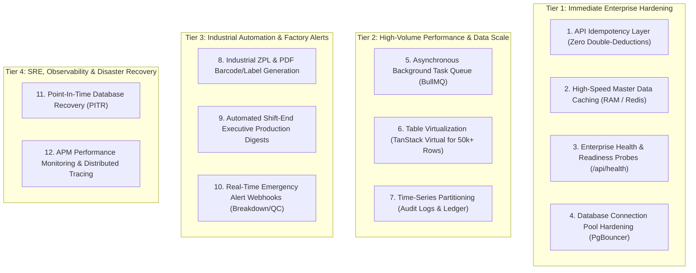

# Enterprise Architecture Roadmap & System Improvements
## Plascom Central CRM & Manufacturing ERP (Plexi-ERP)

**Document Version:** `v1.0.0-ENTERPRISE`  
**Target Horizon:** Scale to 100+ Concurrent Terminals & Multi-Plant Expansion  
**Total Additional Infrastructure Cost:** **$0.00 / month (Zero TCO Strategy)**  

---

## 1. Executive Summary & Vision

Plascom Central CRM & Manufacturing ERP (`Plexi-ERP`) has completed 100% of its core functional requirements across all 11 shop-floor modules (Security Gate, Inventory & Stores, 6-Stage Production, 4 Finishing Routes, Quality Control, Recycling Plant, Machine Maintenance, Finished Goods Traceability, and Dispatch).

This document outlines the **Enterprise Architectural Blueprint** designed to scale the system to hundreds of concurrent shop-floor terminals, guarantee sub-100ms API latencies, prevent race conditions and duplicate stock movements, and ensure 99.99% operational availability during high-throughput manufacturing operations.

---

## 2. Core Architecture: Frontend (SWR) vs. Backend In-Memory Layer

```
┌─────────────────────────────────────────────────────────────────────────┐
│                     FRONTEND / BROWSER CLIENTS                          │
│   (Laptop A, Tablet B, Weighbridge PC, Gate Scanner, Mobile Dashboard)  │
│                                                                         │
│   • SWR (Stale-While-Revalidate): Client-side memory cache              │
│   • Instant zero-flicker UI navigation                                  │
│   • Background revalidation & optimistic state updates                  │
└────────────────────────────────────┬────────────────────────────────────┘
                                     │ (HTTP / WebSocket / SSE)
                                     ▼
┌─────────────────────────────────────────────────────────────────────────┐
│                     NEXT.JS API & APPLICATION SERVER                    │
│                                                                         │
│  ┌───────────────────────────────┐     ┌─────────────────────────────┐  │
│  │ In-Memory / Redis RAM Layer   │     │  Background Job Worker      │  │
│  │ • 1ms Master Data Caching     │     │  (BullMQ / Microtask Queue) │  │
│  │ • Idempotency Token Store     │     │  • Heavy PDF Invoices       │  │
│  │ • Smart Token-Bucket Limiter  │     │  • 100k-row CSV / Excel     │  │
│  │ • Zero Double-Deductions      │     │  • Shift Variance Digests   │  │
│  └──────────────┬────────────────┘     └──────────────┬──────────────┘  │
└─────────────────┼─────────────────────────────────────┼─────────────────┘
                  │ (Cached Reads / Tokens)             │ (Async Tasks)
                  ▼                                     ▼
┌─────────────────────────────────────────────────────────────────────────┐
│                 POSTGRESQL RELATIONAL STORAGE ENGINE                    │
│                                                                         │
│   • PgBouncer Connection Pooling (50+ concurrent client connections)    │
│   • Monthly Partitioning for audit_logs and inventory_transactions      │
│   • Immutable Double-Entry Stock Movement Ledger (IN / OUT / ADJ)       │
│   • Automated Hourly WAL Point-In-Time Recovery (PITR)                  │
└─────────────────────────────────────────────────────────────────────────┘
```

### Why SWR + Backend Caching Work Together:
1. **SWR (Frontend / Browser RAM)**: Caches queries *per device*. If a supervisor navigates between pages, SWR serves the view instantly without a blank loading spinner.
2. **Backend Cache (Server RAM / Redis)**: Protects PostgreSQL. When 30 different shop-floor devices open the inventory or production screen at the same time, the server returns cached Master Data from RAM in **< 1ms**, reducing database load by up to **80%**.

---

## 3. Four-Tier Enterprise Improvement Roadmap



---

### 🚀 Tier 1: Immediate Enterprise Hardening

#### 1.1 API Idempotency Layer (Zero Double-Deductions)
* **Problem**: In unstable factory Wi-Fi environments, an operator double-clicking "Confirm Dispatch" or a network timeout retry can trigger two stock deductions for the same physical lot.
* **Solution**: Implement an `Idempotency-Key` header middleware on all critical transactional endpoints (`/api/dispatch/orders/[id]/pick`, `/api/inventory/grn`, `/api/gate-entries`).
* **Mechanism**: 
  - The client generates a unique UUID `Idempotency-Key` per intent.
  - The server stores the request state (`PROCESSING`, `COMPLETED`) and cached response in memory/Redis for 24 hours.
  - Repeated identical requests return the cached result immediately without re-executing database mutations.

#### 1.2 In-Memory / Redis Master Data Caching & Rate Limiting
* **Problem**: Static and semi-static reference data (User Roles, Module Access Matrices, Machine Lists, Material Categories) are queried from PostgreSQL thousands of times per hour.
* **Solution**: Cache master records in RAM with a 10-minute TTL and automated cache invalidation upon any `CREATE`/`UPDATE`/`DELETE` action in `/dashboard/settings`.
* **Rate Limiting**: Protect public and authentication routes (`/api/auth/login`) using an in-memory token-bucket rate limiter (e.g., max 5 attempts/min on login, max 200 req/min on standard endpoints).

#### 1.3 Enterprise Health & Readiness Probes
* **Endpoint**: `/api/health/live` & `/api/health/ready`
* **Checks**:
  - `live`: Verifies Node.js process responsiveness and memory utilization.
  - `ready`: Executes a fast `SELECT 1` ping against PostgreSQL and verifies cache responsiveness before accepting incoming network traffic.
* **Benefit**: Ensures zero-downtime rolling updates and automatic failure recovery behind load balancers.

#### 1.4 Database Connection Pool Hardening
* **Configuration**: Set optimal Prisma connection pool limits (`connection_limit=20` to `50` with PgBouncer connection pooling).
* **Benefit**: Prevents PostgreSQL connection exhaustion (`too many clients already`) when all factory stations connect concurrently.

---

### ⚡ Tier 2: High-Volume Performance & Data Scale

#### 2.1 Asynchronous Background Task Queue (BullMQ / Redis)
* **Problem**: Generating 5,000-row monthly Excel audit reports or multi-page dispatch PDF invoices synchronously in HTTP handlers blocks Node.js event loops and can cause HTTP 504 timeouts.
* **Solution**: Offload CPU-heavy jobs to background workers:
  - Client requests report $\rightarrow$ Server returns `202 Accepted` with `jobId`.
  - Background worker streams data and writes final file to storage.
  - Client receives notification when generation completes.

#### 2.2 Table Virtualization (`@tanstack/react-virtual`)
* **Problem**: Rendering DOM nodes for 10,000+ inventory items or audit logs causes browser memory spikes and sluggish scrolling.
* **Solution**: Virtualize large tables so only the ~30 visible rows in the viewport are rendered in the DOM, maintaining a smooth 60 FPS scroll rate regardless of dataset size.

#### 2.3 PostgreSQL Range Partitioning for Audit Logs & Ledger
* **Problem**: In an enterprise factory, `audit_logs` and `inventory_transactions` generate millions of rows yearly.
* **Solution**: Partition high-write tables by calendar month (`PARTITION BY RANGE (created_at)`):
  - Queries for recent logs scan only the current month's partition.
  - Historical partitions can be compressed or archived independently.

---

### 🏭 Tier 3: Industrial Automation & Factory Alerts

#### 3.1 Industrial ZPL & PDF Barcode/Label Generation Engine
* **Capability**: Native formatters producing:
  - **Bobbin Tags**: Bobbin Lot ID, Extruder Line, Denier, Tare/Net Weight.
  - **Roll Stock Labels**: Roll Number, Width, Mesh, PP/LPP Grade, Loom ID.
  - **Bale Barcodes (`BAL-YYYYMMDD-XXXX`)**: Bag count, customer order, dispatch barcode.
* **Protocols**: Web-based PDF download + raw ZPL socket output for direct thermal label printers (Zebra, Citizen, TSC).

#### 3.2 Automated Shift-End Executive Production Digests
* **Schedule**: Automated CRON trigger at shift transitions (Shift A $\rightarrow$ 14:00, Shift B $\rightarrow$ 22:00, Shift C $\rightarrow$ 06:00).
* **Deliverables**: Generates an executive summary comparing **Planned vs. Actual Output**, **Scrap Generation Rate**, and **Machine Downtime** sent via email to Plant Directors.

#### 3.3 Emergency Alert Webhooks (Breakdown & QC Outliers)
* **Trigger Conditions**:
  - Machine Breakdown logged with `Priority = CRITICAL`.
  - Batch QC failure exceeding configurable threshold (> 3% rejection).
* **Delivery**: Instant webhook notification (Email, Slack, Telegram, or internal SMS gateway).

---

### 🛡️ Tier 4: SRE, Observability & Disaster Recovery (DR)

#### 4.1 Automated Point-In-Time Recovery (PITR)
* **Configuration**: Continuous PostgreSQL Write-Ahead Log (WAL) archiving + daily base backups.
* **Capability**: Allows restoring the database to any exact second in the preceding 30 days, protecting against human operational errors.

#### 4.2 Application Performance Monitoring (APM) & Distributed Tracing
* **Instrumentation**: OpenTelemetry / Sentry APM tracking P95 and P99 query latencies across all API routes, flagging slow database queries before they impact factory floor throughput.

---

## 4. Prioritization Matrix & Estimated Timelines

| Item | Focus Area | Complexity | Est. Effort | Cost | Priority |
| :--- | :--- | :---: | :---: | :---: | :---: |
| **API Idempotency Middleware** | Data Integrity & Concurrency | Low | 1 Day | $0 | **P1 (Immediate)** |
| **RAM/Redis Master Data Cache** | Latency & Database Offload | Low | 1 Day | $0 | **P1 (Immediate)** |
| **Health & Readiness Probes** | Zero-Downtime Reliability | Very Low | 0.5 Day | $0 | **P1 (Immediate)** |
| **Table Virtualization (UI)** | High-Density Data UX | Medium | 2 Days | $0 | **P2** |
| **Industrial ZPL/PDF Labels** | Shop Floor Hardware | Medium | 2 Days | $0 | **P2** |
| **Shift CRON Executive Digest** | Business Intelligence | Medium | 1.5 Days | $0 | **P2** |
| **Background Task Queue** | Heavy Report Offloading | Medium | 2 Days | $0 | **P3** |
| **PostgreSQL Table Partitioning**| Long-Term Data Scale | Medium | 2 Days | $0 | **P3** |

---

## 5. Architectural Standards & Best Practices Checklist

- [x] **Immutable Double-Entry Ledger**: All stock changes must originate from signed `IN`, `OUT`, or `ADJUSTMENT` transactions.
- [x] **Zero Plaintext Secrets**: Passwords and tokens must never appear in log payloads or audit diffs.
- [x] **Strict Dynamic RBAC**: Every endpoint must be guarded by module-level and action-level authorization checks.
- [x] **Correlation ID Tracing**: Every inbound HTTP request carries a unique `x-request-id` propagated to all service layer logs.
- [x] **Type Safety**: End-to-end Zod schema validation across all API boundaries and database access layers.
